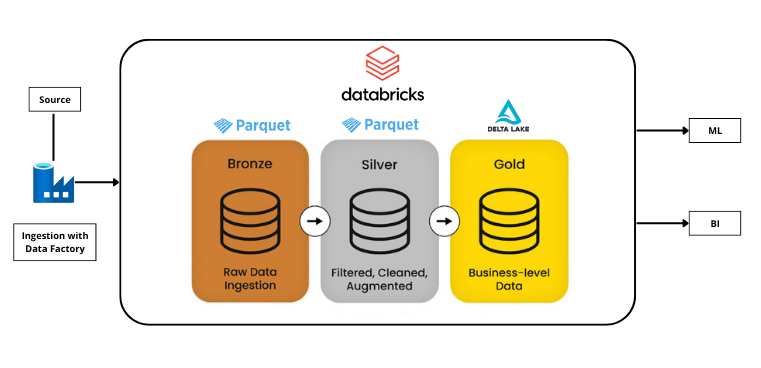
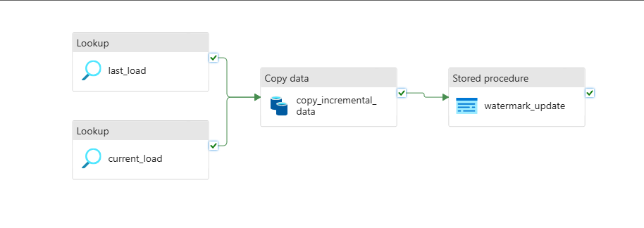
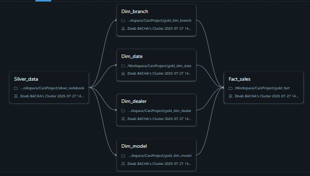

# Databricks incremental ETL pipeline

This project implements a complete ETL pipeline on **Databricks** using the **medallion architecture** (Bronze → Silver → Gold) for building a **modern data warehouse**. It transforms raw car sales data into dimensional models and a fact table optimized for analytics.

---

##  Pipeline Architecture

##  ETL Workflow

### 1. **Bronze Layer**
- Ingest raw data with Azure Data Factory.
- Incremental data loading.
- No transformation applied, just raw storage.

### 2. **Silver Layer**
- Cleaned and standardized data with selected columns.
- Handles nulls, formats, deduplication.
- Stored as curated Delta tables in `silver` zone.

### 3. **Gold Layer**
- Build **dimension tables**: `dim_branch`, `dim_dealer`, `dim_model`, `dim_date`.
- Build **fact table**: `factsales` with foreign keys pointing to dimensions.
- Apply **SCD Type 1** merge logic for upsert handling.

---

## Data Modeling

### Dimension Tables
- `dim_branch (dim_branch_key, Branch_ID, BranchName)`
- `dim_dealer (dim_dealer_key, Dealer_ID, DealerName)`
- `dim_model (dim_model_key, Model_ID, ModelName)`
- `dim_date (dim_date_key, Date, Year, Month, ...)`

### Fact Table
- `factsales (Revenue, Units_Sold, dim_branch_key, dim_dealer_key, dim_model_key, dim_date_key)`

---

## Parameters

### `incremental_flag`
Controls full vs incremental load logic in notebooks.

- `0`: Full load (overwrite or recreate).
- `1`: Incremental load (upsert via Delta merge).

